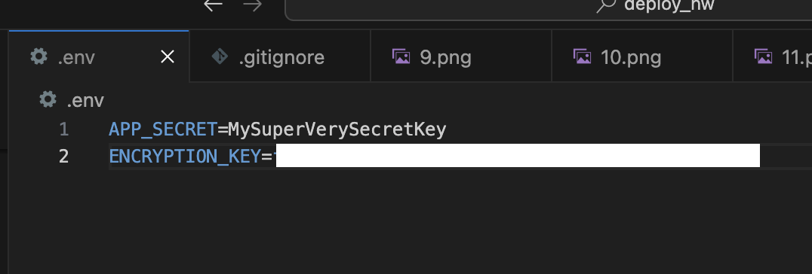
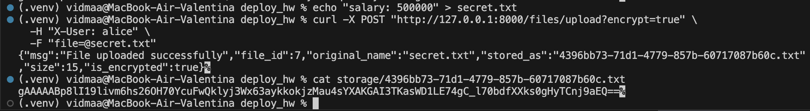
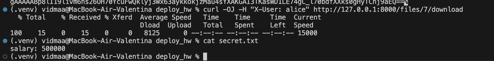

# Домашнее задание 10

## 1. Скриншот локального файла .env (замажьте часть ключа)

## 2. Скриншот терминала сервера, где вы делаете cat storage/... и видите зашифрованный текст

## 3. Скриншот браузера/Postman, где вы скачали этот же файл через API и видите читаемый текст

 
