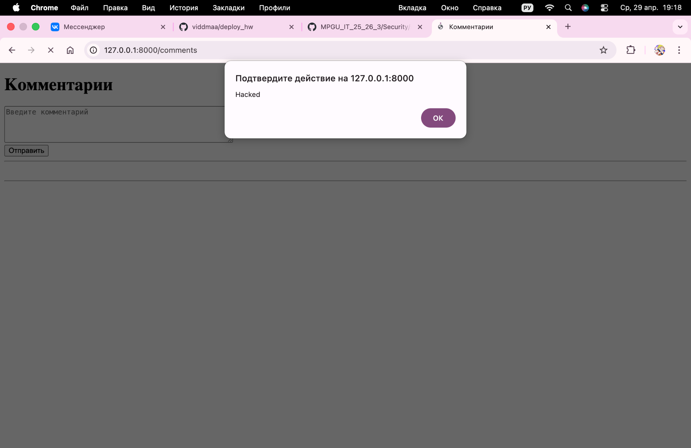
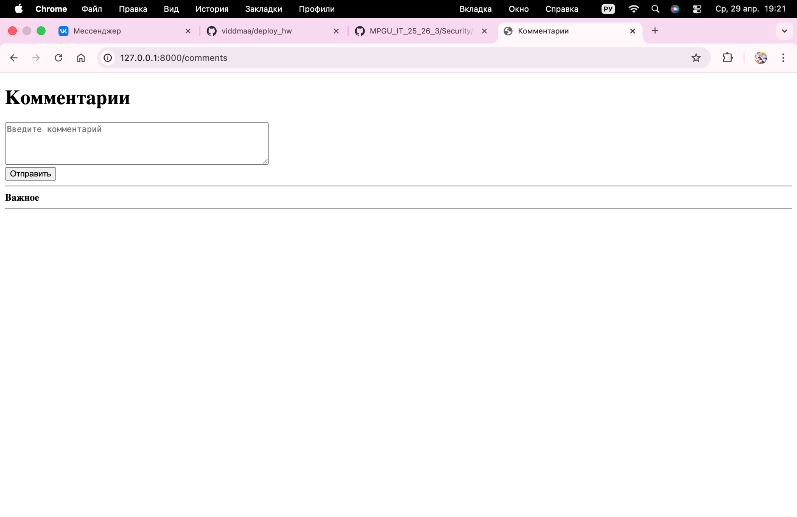
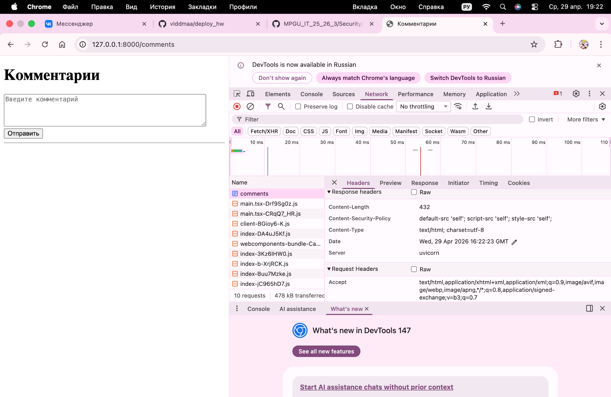
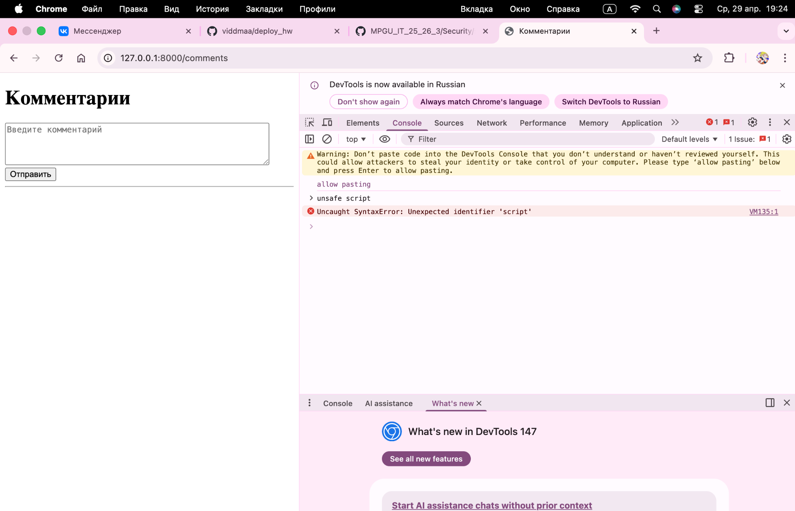

# Домашнее задание 6

## 1. Скриншот успешной XSS-атаки (до защиты)



## 2. Пример кода функции-санитизера



```python
def clean_comment(text: str) -> str:
    return bleach.clean(
        text,
        tags=["b", "i", "u", "em", "strong"],
        attributes={},
        strip=True
    )
```

## 3. Скриншот заголовков ответа (вкладка Network), где виден CSP



## 4. Скриншот заблокированной атаки (из консоли браузера)

 
